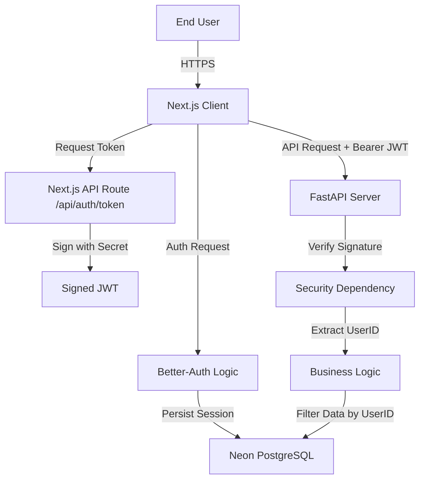

# System Architecture & Monorepo Structure

## 1. System Overview
**Role**: Single Source of Truth for System Interaction.

The application uses a **Decoupled Monorepo** architecture. The Front-End and Back-End are completely separate logical units that share only a cryptographic trust root (`BETTER_AUTH_SECRET`).

### **High-Level Data Flow**


## 2. Directory Structure Scope
The AI Agent MUST respect these boundaries.

```text
/ (Root)
├── frontend/             # [SCOPE: NEXT.JS]
│   ├── app/              # App Router (Pages, Layouts)
│   ├── lib/              # Shared Utilities (Auth Client, API Wrappers)
│   ├── prisma/           # [MASTER SCHEMA] source of truth
│   └── public/           # Static Assets
│
├── backend/              # [SCOPE: PYTHON/FASTAPI]
│   ├── app/
│   │   ├── core/         # Config, Security, DB Connections
│   │   ├── models/       # Pydantic Schemas (Data Validation)
│   │   └── routes/       # API Endpoints
│   └── pyproject.toml    # [STRICT: UV] Package Config
│
└── specs/                # [SCOPE: META] Documentation & Constraints
```

## 3. Technology Stack (Strict Versions)
*   **Frontend**: Next.js 16.1+, React 19, TypeScript 5+, TailwindCSS 4.
*   **Auth**: Better-Auth v1.4+ (Client & Server), `jose` for JWT generation.
*   **Backend**: Python 3.13+, FastAPI 0.115+, Pydantic v2+.
*   **Database**: PostgreSQL 16 (Neon Serverless).
*   **ORM**: Prisma v6+ (Schema Management), `asyncpg` (Backend Driver).
*   **Package Managers**: `npm` (Frontend), `uv` (Backend - **MANDATORY**).

## 4. Cross-System Contracts
1.  **Secret Sharing**: Both `.env` files MUST contain the exact same `BETTER_AUTH_SECRET`.
2.  **Schema Sync**: `frontend/prisma/schema.prisma` is the **Master**. Modifications here require `prisma db push`. The Backend implicitly trusts this structure.
3.  **Port Binding**:
    *   Frontend: `3000`
    *   Backend: `8000`
